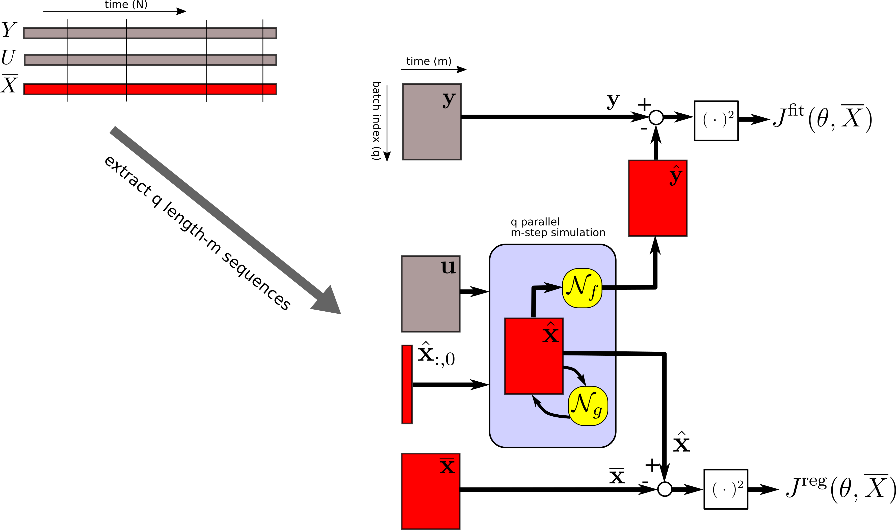

# Model structures and fitting criteria for system identification with neural networks

This repository contains the Python code to reproduce the results of the paper 
[Model structures and fitting criteria for system identification with neural networks](https://arxiv.org/pdf/1911.13034.pdf) by Marco Forgione and Dario Piga.

The following fitting methods for State-Space (SS) and Input-Output (IO) neural dynamical models are implemented

 1. One-step prediction error minimization
 2. Open-loop simulation error minimization
 3. Multi-step simulation error minimization

# Block Diagram

The following block diagram illustrates the proposed multi-step simulation error minimization approach:



# Folders:
* torchid:  pytorch implementation of the fitting methods 1,2,3
* examples: examples of neural dynamical models fitting 
* common:   definition of performance index R-squared, etc.

The [examples](examples) are:

* `` RLC_example``: nonlinear RLC circuit thoroughly discussed in the paper
* `` CSTR_example``: CSTR system from the [DaISy](https://homes.esat.kuleuven.be/~tokka/daisydata.html) dataset 
* `` cartpole_example``: cart-pole mechanical system. Equations are the same used [here](https://github.com/forgi86/pyMPC/blob/master/examples/example_inverted_pendulum.ipynb)
* `` CTS_example``: Cascated Tanks System from the [Nonlinear System Identification Benchmark](http://www.nonlinearbenchmark.org/) website

For the [RLC example](examples/RLC_example), the main scripts are:

 *   ``symbolic_RLC.m``: Symbolic manipulation of the RLC model, constant definition
 * ``RLC_generate_id.py``:  generate the identification dataset 
 * ``RLC_generate_val.py``: generate the validation dataset 
 *  ``RLC_SS_fit_1step.py``: SS model, one-step prediction error minimization
 *  ``RLC_SS_fit_simerror.py``: SS model, open-loop simulation error minimization
 *  ``RLC_SS_fit_multistep.py``: SS model, multistep simulation error minimization
 *  ``RLC_SS_eval_sim.py``: SS model, evaluate the simulation performance of the identified models, produce relevant plots  and model statistics
 *  ``RLC_IO_fit_1step.py``: IO model, one-step prediction error minimization
 *  ``RLC_IO_fit_multistep.py``: IO model, multistep simulation error minimization
 *  ``RLC_IO_eval_sim.py``: IO model, evaluate the simulation performance of the identified models, produce relevant plots  and model statistics
 *   ``RLC_OE_comparison.m``: Linear Output Error (OE) model fit in Matlab
  

# Software requirements:
Simulations were performed on a Python 3.7 conda environment with

 * numpy
 * scipy
 * matplotlib
 * pandas
 * sympy
 * numba
 * pytorch (version 1.3)
 
These dependencies may be installed through the commands:

```
conda install numpy numba scipy sympy pandas matplotlib ipython
conda install pytorch torchvision cpuonly -c pytorch
```

## Citing

If you find this project useful, we encourage you to

* Star this repository :star: 
* Cite the [paper](https://arxiv.org/pdf/1911.13034.pdf) 
```
@misc{model2019,
Author = {Forgione, Marco and Piga, Dario},
Title = {Model structures and fitting criteria for system identification with neural networks},
Year = {2019},
Eprint = {arXiv:1911.13034}
}
```
